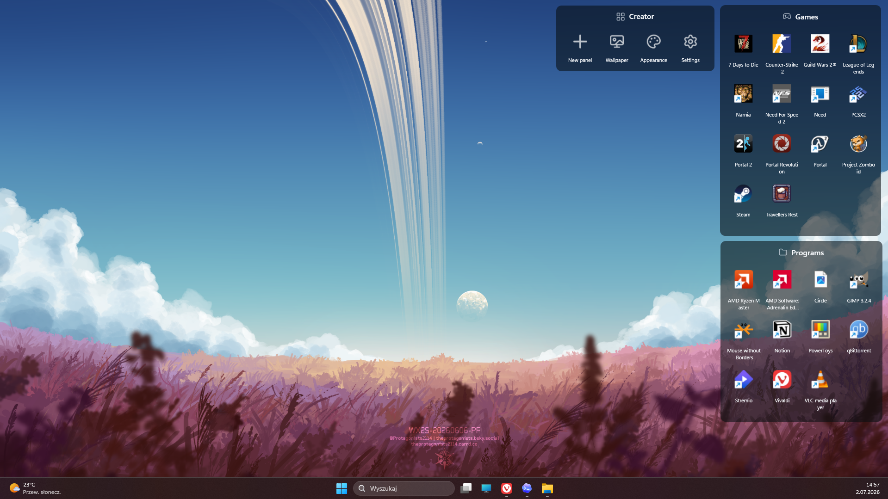
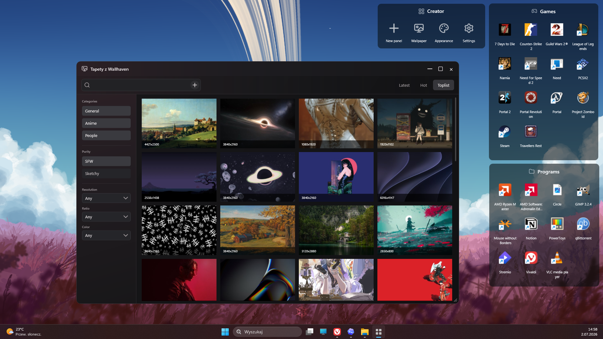

<div align="center">
  

  <h1>My Fancy Fences</h1>

  <p>
    
    
    
    
  </p>

  <p>
    <em>A customizable, open-source tool for organizing your Windows desktop.</em><br />
    <strong>Clean, lightweight, and always within reach.</strong>
  </p>
</div>

---

## 📸 Screenshots

### Desktop panels



### Wallpaper browser



## ✨ Features

- Multiple independent desktop panels
- Folder-backed content with automatic file system updates
- Custom colors, transparency, borders, and corner radius
- Separate typography settings for headers and icon labels
- Adjustable icon size and single-click or double-click activation
- Move files and folders into panels with drag and drop
- Show, hide, create, and remove panels from one settings window
- Apply shared appearance settings across all panels
- Browse Wallhaven wallpapers with search and filters
- Preview, download, and set wallpapers without leaving the app
- System tray controls and optional Windows startup
- Clean Lucide outline icons
- Automatic settings backup

## 🚀 Quick Start

### Requirements

- Windows 10 or Windows 11
- [.NET 10 SDK](https://dotnet.microsoft.com/download/dotnet/10.0)

### Build and run

```powershell
dotnet build "My Fancy Fences.slnx"
dotnet run --project "My Fancy Fences/My Fancy Fences.csproj"
```

## 🖱️ Usage

- Double-click a panel header to edit that panel.
- Use the Creator panel to add panels, browse wallpapers, or open global settings.
- Drag files or folders onto a panel to move them into its source folder.
- Choose single-click or double-click activation for panel items.
- Right-click the tray icon to manage startup or close the application.

## 🛠️ Built With

- WPF and .NET 10
- [MahApps.Metro.IconPacks.Lucide](https://github.com/MahApps/MahApps.Metro.IconPacks)
- [Wallhaven API](https://wallhaven.cc/help/api)

## ⚠️ Project Status

My Fancy Fences is under active development and may still contain bugs. Features and saved-settings formats may change between versions.

## 🤝 Contributing

Issues, suggestions, and pull requests are welcome.

## 📄 License

My Fancy Fences is available under the [MIT License](LICENSE).
